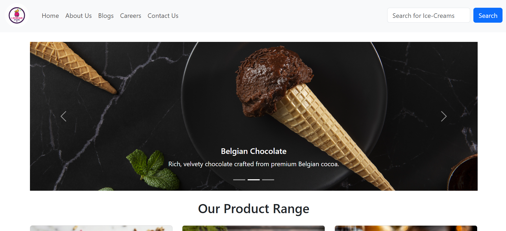
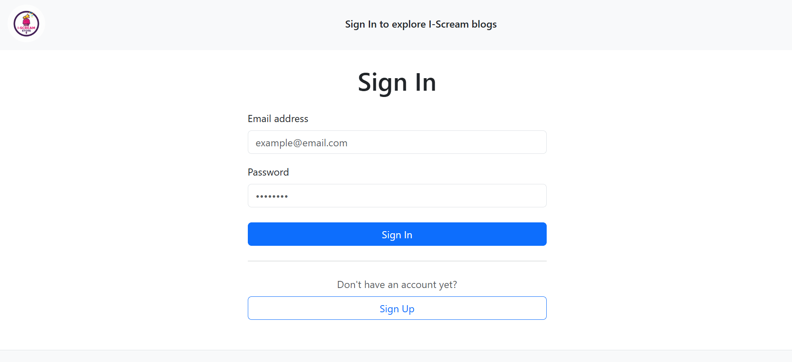
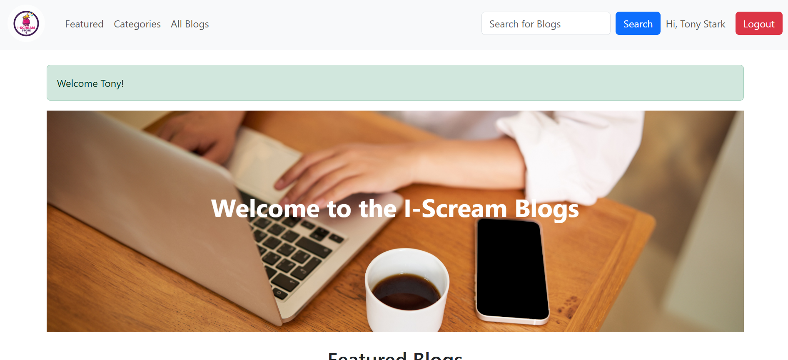

# I_Scream Store

A simple Django project showcasing a website and a blogpage for the I-Scream Store. This repository focuses on the Django framework and contains two apps: `store` and `blogs`.

## Features

- Built with Django.
- Two apps:
  - `store`
  - `blogs`
- Uses SQLite as database (`db.sqlite3`).

## Screenshots

### Home


### Signin Page


### Blogs Page


## Project Structure

- `i_scream_store/` — Django project settings and URLs.
- `store/` — store app: views, templates, static files.
- `blogs/` — blog app: views, templates, static files.
- `db.sqlite3` — development database (SQLite).
- `requirements.txt` — Python dependencies.

## Tech Stack

- **Language:** Python (3.8+ recommended)
- **Framework:** Django (see `requirements.txt` for the pinned version)
- **Database:** SQLite
- **Templates / Static:** Django templates and app-level static files
- **Bootstrap:** For prebuilt CSS and JS

## Installation & Usage

- Windows (PowerShell)

```powershell
python -m venv venv
.\venv\Scripts\activate
pip install -r requirements.txt
python manage.py migrate
python manage.py createsuperuser
python manage.py runserver
```

- macOS / Linux / WSL

```bash
python3 -m venv venv
source venv/bin/activate
pip install -r requirements.txt
python3 manage.py migrate
python3 manage.py createsuperuser
python3 manage.py runserver 0.0.0.0:8000
```

##

<div align="center">The I-Scream-Project. Enjoy! 🍦</div>
